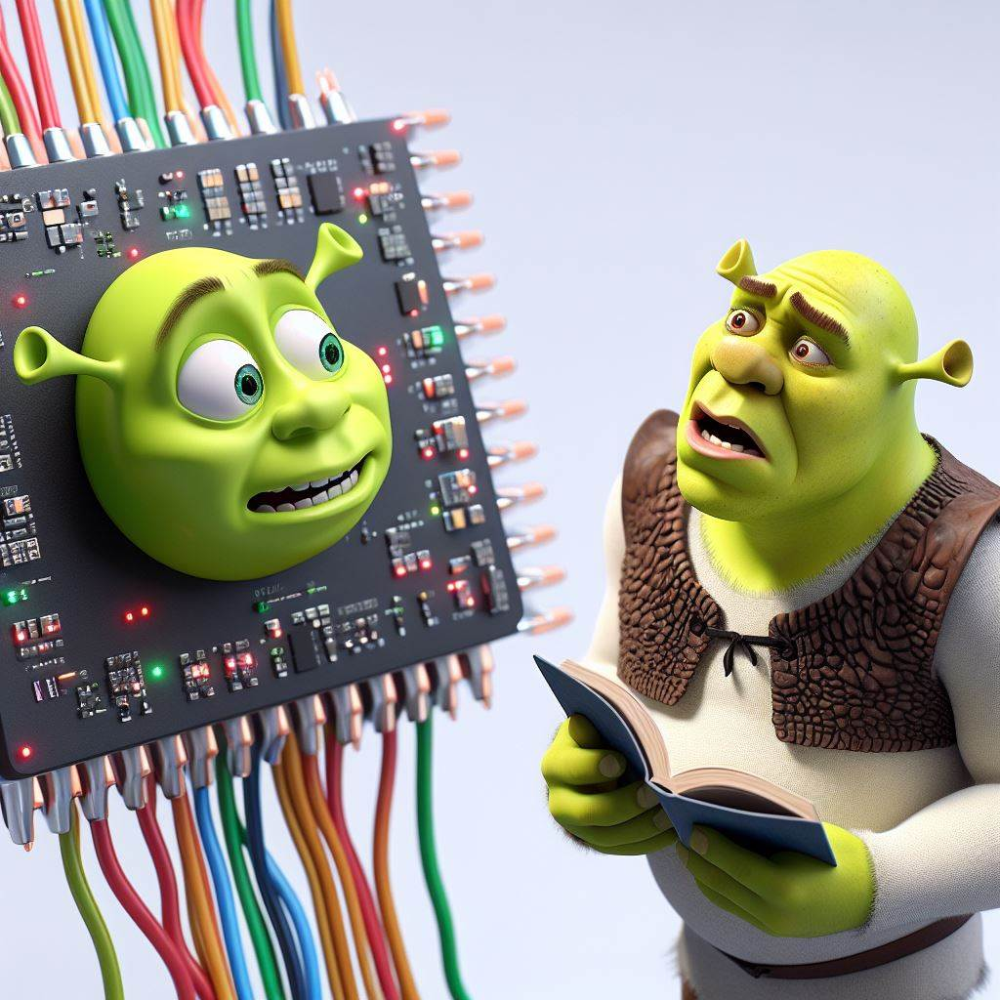

<!-- PROJECT LOGO -->
 

  

  <h3 align="center">AN2DL Projects</h3>

  

    Two neural networks for two tasks
     
    <a href="https://github.com/AlessandroCogollo/AN2DL-Challenges-2023/blob/main/1st%20challenge/Report%20-%20Final%20Version.pdf"><strong>Docs 1st Project »</strong></a>&nbsp;&nbsp;&nbsp;&nbsp;<a href="[https://github.com/othneildrew/Best-README-Template](https://github.com/AlessandroCogollo/AN2DL-Challenges-2023/blob/main/2nd%20challenge/Report.pdf)"><strong>Docs 2nd Project »</strong></a>
     
    
  

<!-- ABOUT THE PROJECT -->
## Neural Networks and Deep Learning 2023/24

This repository contains two projects that completed as part of a university course on Artificial Neural networks and Deep Learning, both graded with a score of 10 out of 10 points. The projects' tasks, as well as training datasets, are described below and can be found here: [1st challenge]([https://codalab.lisn.upsaclay.fr/competitions/16514]), [2nd challenge](https://codalab.lisn.upsaclay.fr/competitions/16514).

- **Plant Health Classification**: The task involves classifying plants into two categories based on their health status using a binary classification network. The dataset consists of 5200 RGB images, each measuring 96x96 pixels. We adopted a systematic approach to tackle the challenge, starting with the LeNet architecture and gradually moving to more complex convolutional neural network (CNN) architectures, ultimately utilizing EfficientNet, to establish a baseline, analyze performance, and introduce more complex architectures for improved classification accuracy.

- **Time Series Prediction**: The task was to predict future samples of input time series using neural networks capable of generalizing across different temporal contexts. The goal of the challenge was to predict 18 steps ahead of 60 univariate time series provided as input. The provided dataset consists of 48,000 time series, each padded to 2,776 for portability. Two additional files were provided: the first one containing the start and end of the validity period for each time series, and the second one containing the category to which each time series belongs. The categories (labeled A, B, C, D, E, F) correspond to different contexts. The time series belonging to each category are not to be understood as related to each other, but only as collected from similar data sources.

Both projects were implemented in Python using TensorFlow and Keras libraries. As libraries, we used matplotlib and seaborn for data visualization, and scikit-learn for evaluation metrics. Further informations can be founded on each sub-folder on the delivery doc, together with the dataset.

<!-- ACKNOWLEDGMENTS -->
## Acknowledgments

Models gathered in this directory have been developed by the *DeadMoustaches* team, composed by:

* [Bianca Savoiu](https://github.com/BiancaSavoiu)
* [Irfan Cela](https://github.com/IrfEazyBiancaSavoiu)
* [Fabio Lusha](https://github.com/FabioLusha)

in the context of the course [Artificial Neural Networks and Deep Learning](http://chrome.ws.dei.polimi.it/index.php?title=Artificial_Neural_Networks_and_Deep_Learning) at @PoliMi (Politecnico di Milano), AY2023/24.
